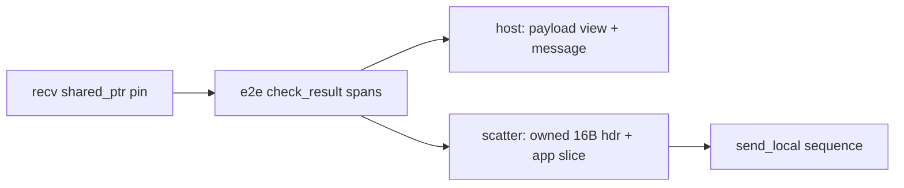

# Receive-path copy elision

> **Status:** In progress on this fork. Goal: pin the receive buffer (or one owned
> buffer) with `shared_ptr` and hand spans / shared payloads down to the app,
> instead of re-copying at strip, deserialize, and notify. Mirror of
> [`send-copy-elision.md`](send-copy-elision.md).
>
> Done: `payload_impl` is always a view over `shared_ptr<vector>` (+ offset/length);
> host delivery uses header parse + pinned/span payload; E2E strip for local
> forward is scatter (`compose_e2e_stripped_sequence`: owned 16B header + app
> slice) — no `materialize` concat. Endpoint → routing `_pin` plumbing still open
> (without pin, forward still owns app bytes only once).

## Problem

A remote message that reaches the hosting application is typically already
contiguous in an endpoint receive buffer (UDP / TCP / local). E2E `check()`
returns **non-owning spans** into that buffer. Upstream then threw that away
with full-frame strip + deserialize copies.

## Ownership model

**One owner:** an external `shared_ptr<vector<byte_t>>` (recv buffer, IPC frame,
or a vector allocated by `create_payload` / `set_data`).

**`payload_impl`:** always non-owning — `buffer_` + `offset_` + `length_`. No
separate owning `data_` path.

**Local forward after E2E check:** `send_local(buffer_sequence)` with:

- owned 16-byte SOME/IP header (length patched for hole-free size)
- `append_buffer_slice` of `check_result.app_payload` when `_pin` covers it,
  else one owned buffer of **app bytes only**

UDS/TCP scatter-write reassembles a contiguous hole-free frame for the peer;
stub/proxy deserialize layout is unchanged.

## Copy inventory (routing host, after this work)

| Stage                                 | Copies                     | Notes                                  |
| ------------------------------------- | -------------------------- | -------------------------------------- |
| Socket → `on_message`                 | **0×**                     | Pointer into UDP/TCP/local recv buffer |
| SOME/IP-TP reassemble                 | **1×** full                | Only when TP segments                  |
| E2E `check()`                         | **0×**                     | Spans into recv buffer                 |
| Host deliver (with `_pin`)            | **0×** payload             | `payload_impl` views pin               |
| Host deliver (no `_pin` yet)          | **1×** app payload         | `create_payload` until endpoint pins   |
| Local forward after E2E (with `_pin`) | **0×** app; **16B** header | `compose_e2e_stripped_sequence`        |
| Local forward after E2E (no `_pin`)   | **1×** app; **16B** header | App-only owned segment                 |
| Proxy client deserialize              | **+2–3×**                  | Open — see checklist                   |

### Totals (payload-sized, remote → hosting app on RM)

| Path               | Target (with endpoint pin) |
| ------------------ | -------------------------- |
| Req/resp, no E2E   | **0×**                     |
| Req/resp, with E2E | **0×**                     |
| Event, with E2E    | **0×** (+ shared filter)   |

## Design notes

### Lifetime

`_data` in `on_message` stays valid only until the next receive reuse unless
something holds a `shared_ptr` on the buffer. Delivered `message` / `payload`
and `buffer_sequence` segments must keep that pin until handlers / async
local writes complete.

### Deliver without full-frame deserialize

`deliver_message` parses SOME/IP header fields and attaches a viewing
`shared_ptr<payload>`. No `deserializer::set_data` of the full frame on the
host path.

### Notifications

One `shared_ptr<payload>` for debounce/filter and host delivery. Other local
subscribers get `send_local(sequence)`.

### Proxy path (open)

Non-routing apps still copy on IPC receive + `send_command` + deserialize.
Scatter send already works; receive elision is separate.

## Implementation checklist

- [ ] Pin receive buffer through routing (`shared_ptr` + slice from endpoints)
- [x] E2E strip without concat: `compose_e2e_stripped_sequence` (host spans + local scatter)
- [x] `payload_impl`: view-only (`shared_ptr` + offset + length)
- [x] `deliver_message`: header-only parse; payload views pin when `_pin` is set
- [x] `deliver_notification`: one shared payload; forward via `send_local(sequence)`
- [x] Unit tests: `payload_impl` pin / view; e2e protect unit tests
- [ ] Network / integration: E2E check + strip-by-span end-to-end
- [ ] Docs: update [`e2e-scatter-gather-send.md`](e2e-scatter-gather-send.md) receive notes
- [ ] _(open)_ Proxy / routing-client deserialize elision
- [ ] _(open)_ TCP/local stream pin when buffer compaction would invalidate slices
- [ ] _(later)_ SOME/IP-TP reassembly without full flatten

## Related docs

- [`send-copy-elision.md`](send-copy-elision.md) — send-side zero-copy / pin model
- [`e2e-scatter-gather-send.md`](e2e-scatter-gather-send.md) — E2E protect/check APIs
  and `check_result` spans
