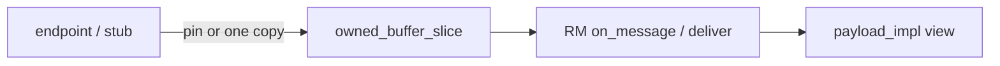

# Receive-path copy elision

> **Status:** In progress on this fork. Goal: pin the receive buffer (or one owned
> buffer) with `shared_ptr` and hand spans / shared payloads down to the app,
> instead of re-copying at strip, deserialize, and notify. Mirror of
> [`send-copy-elision.md`](send-copy-elision.md).
>
> **Ownership rule (routing ingress):** crossing into service-level routing
> receive always takes a required `owned_buffer_slice` (non-null buffer +
> explicit offset/length). Same spirit as send’s required `message_buffer_ptr_t`.
> No `const byte_t*` + optional `_pin = nullptr` on the RM data-plane path.
> Copies, if any, happen at the endpoint/stub edge (`copy_of` or `slice` of an
> existing pin).

## Problem

A remote message that reaches the hosting application is typically already
contiguous in an endpoint receive buffer (UDP / TCP / local). E2E `check()`
returns **non-owning spans** into that buffer. Upstream then threw that away
with full-frame strip + deserialize copies.

## Ownership model

**Crossing into routing receive ⇒ always an `owned_buffer_slice`.**

```cpp
struct owned_buffer_slice {
    message_buffer_ptr_t buffer; // required when valid()
    std::size_t offset{0};
    std::size_t length{0};       // explicit; never "0 means whole buffer"
};
```

Defined in `implementation/endpoints/include/buffer.hpp`. Same type is also a
segment of `buffer_sequence`. Helpers: `whole`, `slice`, `copy_of`,
`from_pointer`, `is_whole()`. Length is always explicit — never “0 ⇒ whole”.

**`payload_impl`:** always non-owning — `buffer_` + `offset_` + `length_`.

**Local forward after E2E check:** `send_local(buffer_sequence)` with:

- owned 16-byte SOME/IP header (length patched for hole-free size)
- `append_buffer_slice` of `check_result.app_payload` when it lies in the
  frame’s buffer, else one owned buffer of **app bytes only**



## Copy count by era

Counts are **extra payload-sized copies after the socket/IPC fill**. Owned 16B
E2E headers are noted separately, not as “1×”.

Three columns only — do not mix stages across eras in one row:

| Path | Before scatter / pin work | Now (required slice) | Target |
| ---- | ------------------------- | -------------------- | ------ |
| UDP → hosting app (no E2E) | several (strip + deserialize + …) | **0×** (datagram pin via `slice`/`whole`) | **0×** |
| TCP/UDS → hosting app (no E2E) | several | **1×** (`copy_of` at byte* edge) | **0×** (exact-frame) |
| Network → hosting app (with E2E) | several more (materialize strip, …) | UDP **0×** / TCP **1×** edge; then views | **0×** (+ shared filter) |
| Network → other local (E2E strip forward) | full concat / materialize | same edge as above; then **16B** hdr + app slice | **0×** edge; same **16B** + slice |
| Stub IPC → RM | often already owned / varied | **0×** (`slice` of IPC frame) | **0×** |
| SOME/IP-TP reassemble | **1×** full | **1×** full | **1×** until TP elision |
| Proxy deserialize | **+2–3×** | **+2–3×** | open |

**Now, in one sentence:** UDP pins the datagram `shared_ptr` into
`routing_host::on_message(owned_buffer_slice)` (server allocates a fresh recv
buffer each datagram). TCP/UDS still enter via `byte*` + one `copy_of`. After
the edge owns a slice, deliver / E2E / local forward only view or scatter.

## Design notes

### Lifetime

`routing_host::on_message(const byte_t*, …)` pointers stay valid only until the
next receive reuse (TCP/UDS today). UDP passes an `owned_buffer_slice` that
keeps the datagram buffer alive. After `copy_of` / `slice`, any `payload_impl`
/ `buffer_sequence` built from the frame keep the buffer alive until handlers /
async local writes complete.

### Deliver without full-frame deserialize

`deliver_message(owned_buffer_slice)` parses SOME/IP header fields and attaches
a viewing `shared_ptr<payload>`. No `deserializer::set_data` of the full frame
on the host path.

### Notifications

One `shared_ptr<payload>` for debounce/filter and host delivery. Other local
subscribers get `send_local(sequence)`.

### Staging (endpoints)

1. Stub SEND: slice of IPC SOME/IP region (done).
2. RM internal forwards / deliver: consume slice only (done).
3. UDP: pass datagram pin as `whole` / used-bytes `slice` (done; server no longer
   recycles the recv buffer).
4. TCP/UDS: exact-frame alloc after 16B length parse, or one copy out of the
   stream window (avoids compaction invalidation) — open until then.

### Proxy path (open)

Non-routing apps still copy on IPC receive + `send_command` + deserialize.
Scatter send already works; receive elision is separate.

## Implementation checklist

### Done — ownership + RM path (not end-to-end zero-copy)

- [x] Required `owned_buffer_slice` at service-level routing ingress
- [x] Unified slice type for receive and `buffer_sequence` segments
- [x] Stub SEND: `slice` of IPC frame (**0×** on that path)
- [x] Network interim: `routing_host(byte*)` → `copy_of` into RM (**1×** for TCP/UDS; UDP pins)
- [x] Host deliver / notify / E2E strip: views + scatter only (no extra payload copies after the edge owns a slice)
- [x] `payload_impl` view-only; unit tests for payload pin + e2e protect

### Remaining — toward network **0×** target

- [x] **UDP:** pass datagram recv `shared_ptr` as `whole` / used-bytes `slice` (drops the edge `copy_of`)
- [x] `routing_host::on_message(owned_buffer_slice, …)` overload (byte* kept for TCP/UDS; default forwards)
- [ ] **TCP/UDS:** exact-frame alloc after 16B length parse (preferred), or copy one message out of the stream window — do **not** pin into a buffer that compaction can move
- [ ] Retire byte* + `copy_of` once TCP/UDS/local endpoints are plumbed
- [ ] Network / integration coverage for E2E check + strip-by-span with a real pin

### Later / separate tracks

- [ ] Proxy / routing-client deserialize elision
- [ ] SOME/IP-TP reassembly without full flatten
- [ ] Sync receive notes in [`e2e-scatter-gather-send.md`](e2e-scatter-gather-send.md)
- [ ] SD `on_message` (stays `byte*` until SD needs it)
- [ ] Public `application` / `message` APIs unchanged by design

## Related docs

- [`send-copy-elision.md`](send-copy-elision.md) — send-side zero-copy / pin model
- [`e2e-scatter-gather-send.md`](e2e-scatter-gather-send.md) — E2E protect/check APIs
  and `check_result` spans
